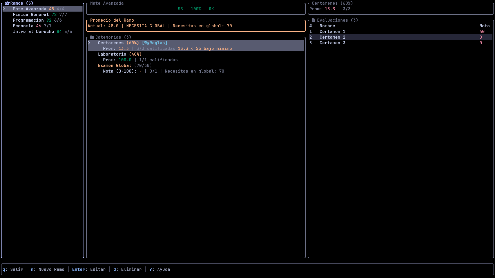

<div align="center">

# KALK

**Tu dashboard académico en la terminal.**

Gestiona ramos, registra notas por categorías y calcula automáticamente la nota que necesitas para aprobar — todo sin tocar el mouse.

[](https://www.rust-lang.org/)
[](https://github.com/ratatui-org/ratatui)
[](LICENSE)

</div>



---

## Características

| Característica | Descripción |
|----------------|-------------|
| **Sistema jerárquico de notas** | Estructura Ramo → Categorías → Evaluaciones con ponderaciones |
| **Cálculo en tiempo real** | Muestra exactamente qué nota necesitas en cada evaluación para aprobar |
| **Plantillas de ramos** | Plantillas predefinidas + crea tus propias plantillas reutilizables con `t` |
| **Validación de pesos** | Indicadores visuales cuando los pesos no suman 100% |
| **Auto-balance** | Distribuye automáticamente los pesos equitativamente entre categorías |
| **Persistencia automática** | Los datos se guardan localmente (`XDG_DATA_HOME/kalk`) y persisten entre sesiones |
| **Solo teclado** | TUI rápido y ligero — no se necesita mouse |

---

## Cálculo de Notas

- **Escala**: 0-100 puntos
- **Nota de aprobación por defecto**: 55
- **Redondeo**: 0.5+ redondea hacia arriba (entonces 54.5 → 55 = aprobado)
- **Indicadores por evaluación**: Muestra "Necesitas X+ en esta eval para aprobar" al editar

---

## Instalación

### Requisitos

- [Rust & Cargo](https://rustup.rs/) o [Nix](https://nixos.org/)

### Usando Cargo

```bash
git clone https://codeberg.org/Kyronix/Kalk.git
cd Kalk
cargo run --release
```

### Usando Nix

```bash
nix develop
cargo run
```

El entorno Nix incluye `cargo-audit` para análisis de seguridad.

---

## Atajos de Teclado

### Navegación

| Tecla | Acción |
|:-----:|--------|
| `Tab` | Ciclar foco entre paneles |
| `h` / `←` | Enfocar panel izquierdo |
| `l` / `→` | Enfocar panel derecho |
| `j` / `↓` | Moverse hacia abajo en la lista |
| `k` / `↑` | Moverse hacia arriba en la lista |

### Acciones

| Tecla | Acción |
|:-----:|--------|
| `n` | Crear nuevo item (ramo/categoría/evaluación) |
| `Enter` | Editar item seleccionado |
| `d` | Eliminar item seleccionado |
| `t` | Guardar ramo actual como plantilla |
| `b` | Auto-balancear pesos de categorías |
| `Ctrl+L` | Cambiar idioma |
| `q` | Salir |

### En Popups

| Tecla | Acción |
|:-----:|--------|
| `Tab` | Cambiar entre campos de entrada |
| `Enter` | Confirmar |
| `Esc` | Cancelar |

---

## Estructura del Proyecto

```
src/
├── main.rs        # Punto de entrada, configuración del terminal
├── app.rs         # Estado y lógica de la aplicación
├── model.rs       # Estructuras de datos (Course, Category, Evaluation)
├── templates.rs   # Plantillas de ramos predefinidas (fácil de modificar)
├── ui.rs          # Renderizado con Ratatui
├── events.rs      # Manejo de eventos de teclado
├── i18n.rs        # Manejo de traducciones
└── persistence.rs # Almacenamiento JSON

~/.local/share/kalk/
├── data.json           # Tus datos de ramos
├── config.json         # Tus configuraciones
└── user_templates.json # Tus plantillas personalizadas
```

---

## Stack Tecnológico

| Herramienta | Propósito |
|-------------|-----------|
| [Ratatui](https://github.com/ratatui-org/ratatui) | Renderizado TUI |
| [Crossterm](https://github.com/crossterm-rs/crossterm) | Backend de terminal |
| [Serde](https://serde.rs/) | Serialización JSON |
| [color-eyre](https://github.com/yaahc/color-eyre) | Manejo de errores |

---

## Desarrollo

```bash
# Entrar al entorno de desarrollo
nix develop

# Ejecutar tests
cargo test

# Lint
cargo clippy

# Auditoría de seguridad
cargo audit
```

---

## Licencia

**GNU Affero General Public License v3.0 (AGPL-3.0)**

Ver [LICENSE](LICENSE) para más detalles.

---

<div align="center">

Hecho con ❤️, 🦀 Rust y ❄️ Nix

</div>
