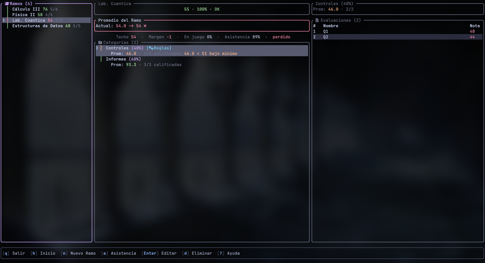

<div align="center">


<h1>KALK</h1>

**Your academic dashboard in the terminal.**

[](README_ES.md)
[](https://www.rust-lang.org/)
[](LICENSE)

</div>



---

## What it is

Kalk answers the question a spreadsheet never quite does: **am I going to pass,
and what do I need to do about it?**

You describe how a course is graded — its categories, their weights, the rules
buried in the syllabus — and Kalk keeps telling you where you stand. Not an
estimate: ungraded work counts as zero, so the number you see is the floor, and
next to it the ceiling you can still reach.

It runs in the terminal, entirely on the keyboard, and stores everything as
plain JSON on your own machine.

## What it does

**Tracks a course the way it is actually graded.** Categories with weights,
evaluations inside them, and the rules that come with real syllabi: drop the
lowest N, geometric means, minimum averages, minimums per evaluation, grade
ceilings, attendance requirements and global exams.

**Tells you what you need.** For any ungraded evaluation it computes the exact
mark that would get you through — and says so plainly when no mark would,
because a rule already put passing out of reach.

**Keeps your semesters.** Past semesters stay, with a dashboard over them:
average and reachable ceiling, how much of the grade is still in play, credits
at risk, and which course needs attention first.

**Reads a syllabus for you.** The import wizard hands you a prompt to paste
into any AI along with the syllabus PDF; you paste the answer back and review
every rule before it is applied.

**Speaks English and Spanish**, in full, switchable at any time.

## Grading

Grades run 0-100, passing at 55 by default and configurable per course.
Rounding follows the usual rule — 54.5 becomes 55, which passes.

Ungraded evaluations always count as zero. That is deliberate: it makes the
displayed grade your real current standing rather than an optimistic guess.

## Installing

```bash
git clone https://github.com/yfloress/Kalk.git
cd Kalk
./install.sh --user      # into ~/.local
```

Or `sudo ./install.sh` for a system-wide install. The script builds Kalk if it
needs to, then puts the binary, the desktop entry and the icon in place; add
`--uninstall` to take them out again.

You need [Rust](https://rustup.rs/) 1.85+, and a
[Nerd Font](https://www.nerdfonts.com/) if you want the icons — Kalk asks on
first run and falls back to plain Unicode if you say no.

Working on Kalk instead of installing it? `nix run` starts it straight from the
source tree. For notes on macOS, Fedora, Debian and Arch, see the
[installation guide](docs/INSTALL.md).

## Getting around

Press `?` at any time for the full keyboard reference. Everything is reachable
without the mouse.

Your data lives in `XDG_DATA_HOME/kalk` as readable JSON — back it up, sync it,
or edit it by hand if you like.

## Contributing

[`AGENTS.md`](AGENTS.md) documents the architecture and the conventions the
codebase holds itself to. `nix develop` gives you the full toolchain.

## License

**GNU Affero General Public License v3.0 or later.** See [LICENSE](LICENSE).

<div align="center">

Built with 🦀 Rust and ❄️ Nix

</div>
